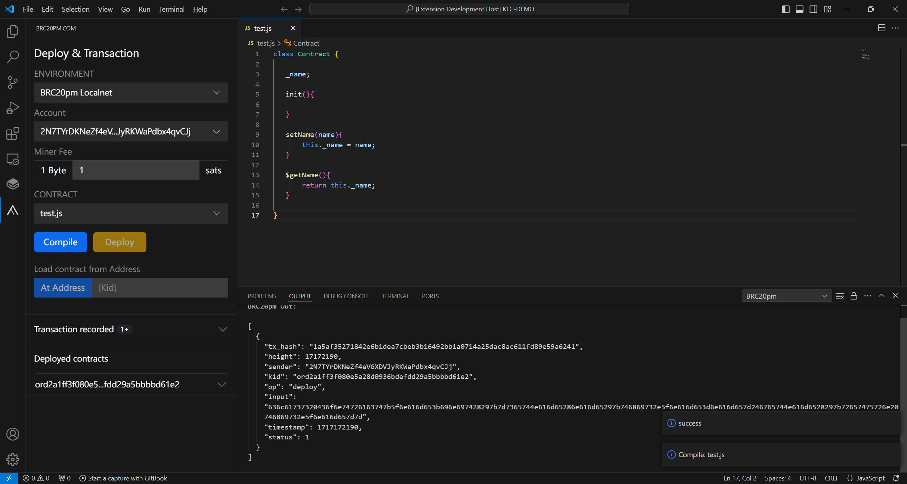
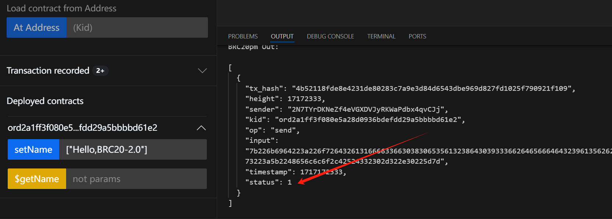
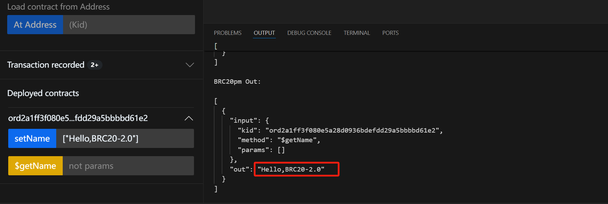

---
id: first-script
title: The First Script
sidebar_label: The First Script
slug: /guide/first-script
--- 


# The first script

Next we will use **local test environment**

Create a script containing **Get and Set** functions to write and read the variable `name`


## Create script

Create a new `new_test6.js` file:

```javascript
class script {

     _name;

     init(){
        
     }
    
     setName(name){
         this._name = name;
     }
    
     $getName(){
         return this._name;
     }
    
}
```

:::caution

**In the BitScpt protocol, function names starting with $ are read-only functions, _ are private functions, and functions without any symbols are write functions**

:::


## Deploy script

After deployment is completed, you will see the following interface:



## script interaction

First, we call the `$getName` function of the script for the first time to obtain the `name` value.

As shown in the figure, the `name` value at this time is empty.


Next we call the `$setName` function of the script and pass in `Hello-BTC`

As shown in the figure, the transaction is successful `success status: 1` `failure status: 0`



Next, we call the `$getName` function of the script again to obtain the `name` value

As shown in the figure, the value at this time is already the `Hello-BTC` we just passed in.



**Have you learned it?**

Let's take it one step further! ! !