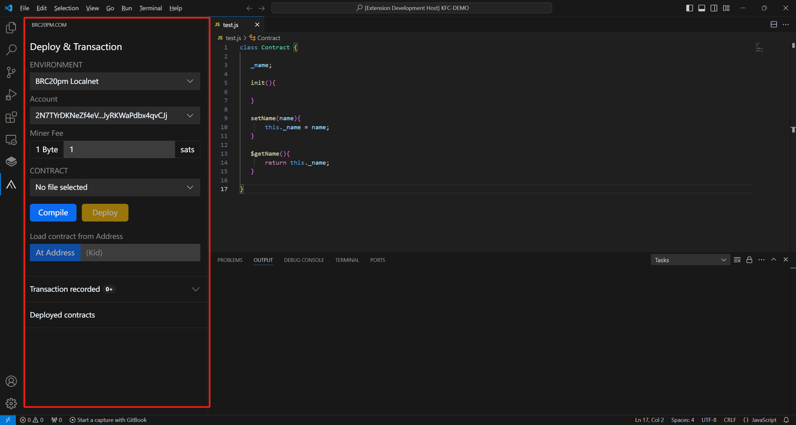

---
id: preparations
title: Preparations
sidebar_label: Preparations
slug: /guide/preparations
--- 


# Development preparation

In this document we will download & install Visual Studio Code and OrdScript plug-ins to prepare for the next development

## install VSCode

Download & Install Visual Studio Code

```bash
https://code.visualstudio.com/
```
## install OrdScript-Plugin

Download OrdScript plugin

```bash
https://github.com/bitscpt/release/tree/main/plugin
```

Install the downloaded plug-in locally:


After installation is complete

Open the plug-in and you will see the following interface


