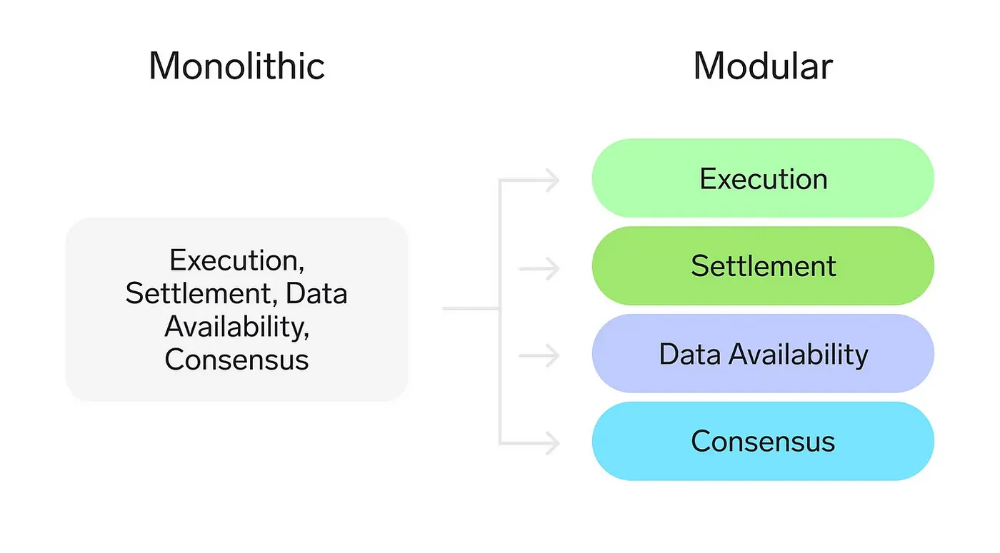

**Modular blockchain** refers to a blockchain that completely outsources at least one of the four components of "execution layer, settlement layer, consensus layer, and data availability layer" to an external chain. Because serving millions or billions of users on a monolithic chain was too complex and had limited solution capabilities, people proposed sharding and Layer 2 solutions, which later evolved into modular blockchains.

### The Modular Blockchain Stack
The four main blockchain layers: 

**Execution**: The environment where applications live and state changes are executed 

**Settlement**: An optional hub for execution layers to verify proofs, resolve fraud disputes, and bridge between other execution layers.

**Consensus**: Agreement on the order of transactions

**Data Availability**: Verification that transaction data is available to download

### Bitcoin's Shortcoming

Bitcoin, in its original design, lacks certain components of the modular blockchain stack that are essential for supporting complex smart contracts directly on its Layer 1. This is primarily because Bitcoin was conceived as a peer-to-peer electronic cash system, focusing on simplicity, security, and decentralization over programmability. Here are some key reasons why Bitcoin doesn't inherently include the necessary pieces for comprehensive smart contract functionality:

- **Limited Scripting Language**: Bitcoin's scripting language, Script, is intentionally limited in its capabilities to ensure security and simplicity. It lacks the Turing completeness found in languages used by platforms like Ethereum, which restricts the types of logic and conditions that can be executed in Bitcoin smart contracts.

- **Data and State Storage**: Bitcoin's blockchain is optimized for storing transaction data rather than the state information required by complex smart contracts. The lack of statefulness in Bitcoin's design makes it challenging to implement dynamic smart contracts that can interact and update according to varying conditions.

- **Execution Environment**: Bitcoin does not have a native execution environment that can run complex smart contracts. Platforms that support advanced dApps, like Ethereum, have a Virtual Machine (EVM) that provides a controlled environment for executing smart contracts. Bitcoin's architecture does not include a comparable component for processing complex decentralized applications.

### The Ordinal & ORDS Upgrade

**Enhanced Data Availability**: By enabling the storage of additional data within transactions, ordinals expand Bitcoin's utility as a data ledger, not just a financial ledger. This increased data availability opens up new possibilities for embedding state information and metadata directly on-chain, which is crucial for applications like smart contracts that require accessible and verifiable state data.

**Execution Layer Creation** : OrdScript creates Bitcoin's Execution Layer by introducing smart contract programmability directly on Bitcoin's Layer 1. This allows for the execution of complex applications and state changes, expanding Bitcoin's capabilities beyond simple transactions to include decentralized applications (dApps), DeFi protocols, and more.