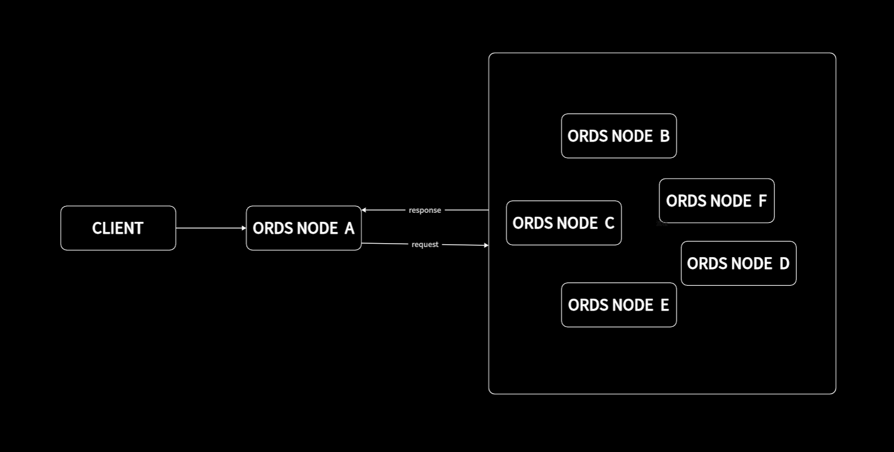

Off-chain reporting (OCR) is an important step towards increasing the decentralization and scalability of the BRC20pm module.
For off-chain reporting aggregators, all nodes communicate using a peer-to-peer network. During the communication process, a lightweight consensus algorithm runs and each node reports its data response and signs it. Then transmit a single aggregate response,
The report contained in the aggregate response is signed by a quorum of nodes and contains the response results from all valid peers. By aggregating the P2P network to verify response reports and checking quorum signatures on responses, we preserve the trustless properties of the BRC20pm module.


## How does OCR work?

Protocol execution occurs primarily off-chain on a peer-to-peer network between BRC20pm nodes. Whenever a user obtains data through the off-chain reporting interface, the node that receives the request is the leader node that drives the rest of the protocol.
The leader asks the remaining nodes to provide response results and compiles them into a report. It then sends this report back to the follower after verifying the authenticity of the signature. The leader will aggregate the 51% threshold report with the quorum's signatures and respond to the requesting client.





You can use it using JSON-RPC

```json
{
	"jsonrpc": "2.0",
	"method": "ocr_call",
	"params": {
		"quorum": 21, //Optional parameters, range 1-21, default 21
		"call_data": {
			"kid": "ord83633b22d3b7a211333081bece366c8f121994a",
			"method": "$name",
			"params": []
		}
	},
	"id": "dd7bce47-26de-44f5-a6ca-5b1d7b03b215"
}
```
